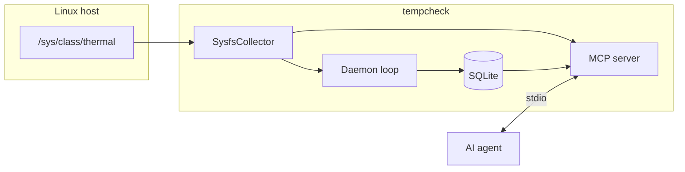

# Architecture

tempcheck has three runtime surfaces: a polling daemon, a one-shot CLI, and an MCP stdio server.

## Components

| Module | Role |
|--------|------|
| `collector` | Reads millidegree values from thermal zones |
| `storage` | SQLite schema, inserts, time-range analysis |
| `daemon` | Tokio interval loop with graceful shutdown |
| `mcp` | rmcp tools for live + historical queries |
| `audit` | JSONL SIEM events per MCP invocation |

## Data model

Table `temperature_readings`:

- `sensor_name` — e.g. `thermal_zone0:cpu`
- `temperature_c` — Celsius
- `recorded_at` — RFC3339 UTC

## Deployment

- **Daemon**: long-running process or Docker `daemon` service
- **MCP**: separate process; shares the SQLite file with the daemon
- **Container**: non-root user, `/data` volume for DB, thermal sysfs mounted read-only

## Related

- [Daemon](features/daemon.md)
- [MCP server](features/mcp-server.md)
- [Threat model](security/threat-model.md)
